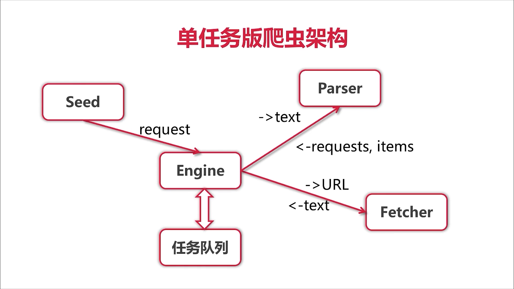
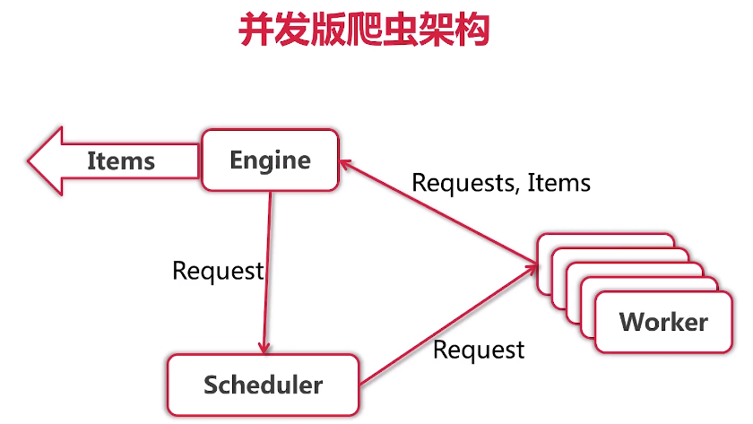
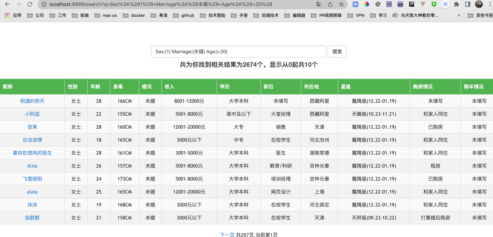

# 🕷️ go-spider

<p align="center">
  
  
  
</p>

> 🚀 **基于 Go 语言的高性能并发爬虫框架**，采用现代并发模型与高效数据处理策略，支持多数据源并行爬取与存储。

---

## ✨ 项目亮点

| 特性 | 说明 |
|------|------|
| 🏗️ **Worker 协程池** | 可配置并发度，充分利用多核 CPU 资源 |
| 📊 **队列调度器** | 双队列设计，实现请求与 Worker 的公平匹配 |
| ⚡ **扇入扇出模型** | 图片下载场景下，多级协程并发处理 |
| 💾 **批量数据存储** | ES 批量入库 + CSV 缓冲写入，减少 I/O 开销 |
| 🛡️ **优雅退出机制** | Context 超时控制 + 信号监听，确保数据完整性 |
| 🔄 **自动重试机制** | 网络请求失败自动重试，提高爬取成功率 |

---

## 📁 项目结构

```
go-spider/
├── engine/              # 爬虫引擎核心（Worker 池 + 任务编排）
│   ├── concurrent.go    # 并发引擎：Context 管理、优雅退出
│   ├── simple.go        # 单任务引擎
│   └── worker.go        # 任务执行器
├── scheduler/           # 任务调度器
│   ├── queued.go        # 双队列调度器（请求队列 + Worker 队列）
│   └── simple.go        # 简单调度器
├── fetcher/             # 网络抓取模块
│   └── fetcher.go       # HTTP 请求 + 重试机制
├── persist/             # 数据持久化
│   ├── itemsaver.go     # ES 批量存储
│   └── fileitemsaver.go # CSV + 图片下载（扇入扇出）
├── types/               # 通用类型定义
├── zhenai/              # 珍爱网爬虫（ES 存储）
├── 3gbizhi/             # 3G 壁纸爬虫（CSV + 图片下载）
├── frontend/            # Web 展示界面
└── single-task/         # 单任务版本（学习用）
```

---

## 🏛️ 架构设计

### 1. 并发爬虫核心架构

```
┌─────────────┐     ┌─────────────┐     ┌─────────────────────────────┐
│  Seed URLs  │────▶│  Scheduler  │────▶│       Worker Pool           │
└─────────────┘     │  (双队列)    │     │  ┌─────┐ ┌─────┐ ┌─────┐   │
                    └─────────────┘     │  │  W1 │ │  W2 │ │ WN  │   │
                           │            │  └──┬──┘ └──┬──┘ └──┬──┘   │
                           │            └─────┼───────┼───────┼──────┘
                           ▼                  ▼       ▼       ▼
                    ┌─────────────┐     ┌─────────────────────────────┐
                    │  New Links  │◀────│         Fetcher             │
                    │  (反馈循环)  │     │    (HTTP + Retry)           │
                    └─────────────┘     └─────────────┬───────────────┘
                                                      │
                                                      ▼
                                              ┌─────────────┐
                                              │   Parser    │
                                              │  (goquery)  │
                                              └──────┬──────┘
                                                     │
                         ┌───────────────────────────┼───────────────────────────┐
                         │                           │                           │
                         ▼                           ▼                           ▼
                ┌─────────────────┐      ┌─────────────────┐      ┌─────────────────┐
                │  Item Processor │      │  Item Processor │      │  Item Processor │
                │   (ES Bulk)     │      │   (CSV Batch)   │      │ (Image Download)│
                └─────────────────┘      └─────────────────┘      └─────────────────┘
```

### 2. 图片下载扇入扇出模型

```
┌─────────────────────────────────────────────────────────────────────────┐
│                           图片下载并发模型                                │
├─────────────────────────────────────────────────────────────────────────┤
│                                                                         │
│   ┌─────────────┐                                                       │
│   │  Album #1   │──┐                                                    │
│   │ (10 images) │  │    ┌─────────┐    ┌─────────┐    ┌─────────┐      │
│   └─────────────┘  │    │ Worker  │    │ Worker  │    │ Worker  │      │
│                    ├───▶│  #1     │    │  #2     │    │  #N     │      │
│   ┌─────────────┐  │    │(Fan-out)│    │(Fan-out)│    │(Fan-out)│      │
│   │  Album #2   │──┘    └────┬────┘    └────┬────┘    └────┬────┘      │
│   │ (8 images)  │            │              │              │           │
│   └─────────────┘            └──────────────┼──────────────┘           │
│                                             │                          │
│                                             ▼                          │
│                                    ┌─────────────────┐                 │
│                                    │   Fan-in Wait   │                 │
│                                    │   (sync.WaitGroup)                 │
│                                    └────────┬────────┘                 │
│                                             │                          │
│                                             ▼                          │
│                                    ┌─────────────────┐                 │
│                                    │  Batch CSV Write│                 │
│                                    │  (Mutex Lock)   │                 │
│                                    └─────────────────┘                 │
│                                                                         │
│   并发控制：信号量 (Semaphore) 限制最大并发数，防止资源耗尽              │
└─────────────────────────────────────────────────────────────────────────┘
```

---

## 🛠️ 技术栈

| 模块 | 技术选型 | 核心作用 |
|------|----------|----------|
| 并发基础 | `goroutine` + `channel` | Go 原生并发模型 |
| 调度器 | 双队列设计 | 请求队列 + Worker 队列公平匹配 |
| HTTP 请求 | `net/http` + `retry-go` | 带重试的稳定请求 |
| HTML 解析 | `goquery` | 类 jQuery 的 DOM 操作 |
| 数据存储 | `olivere/elastic/v7` | ES 批量写入 |
| 图片处理 | `golang.org/x/image/webp` | WebP 解码转 JPG |
| 信号处理 | `os/signal` + `context` | 优雅退出机制 |

---

## 🚀 快速开始

### 环境要求

- Go >= 1.25
- Elasticsearch 7.x+（可选，用于珍爱网数据存储）

### 运行项目

```bash
# 克隆项目
git clone git@github.com:HeRedBo/go-spider.git
cd go-spider

# 安装依赖
go mod tidy

# 运行 3G 壁纸爬虫（默认）
go run main.go

# 启动 Web 展示界面
cd frontend
go run start.go
# 访问 http://localhost:8080
```

---

## 📊 功能模块详解

### 1️⃣ 珍爱网爬虫（结构化数据）

**技术方案：**
- 直接抓取 `window.__INITIAL_STATE__` JSON 数据，避免 DOM 解析开销
- ES 批量入库（Bulk API），默认每批 1000 条
- 支持城市列表 → 用户列表 → 用户详情的层级爬取

**数据模型：**
```go
type Member struct {
    Name      string
    Age       int
    Gender    string
    Location  string
    // ... 更多字段
}
```

**存储结构：**
- 索引：`dating_profile`
- 包含用户基本信息、择偶条件等结构化数据

---

### 2️⃣ 3G 壁纸爬虫（媒体资源）

**技术方案：**
- 列表页 → 详情页 → 子页面三级爬取
- **扇入扇出模型**：每个图集启动一级协程，每张图片启动二级协程
- 信号量控制并发度（默认 20），防止资源耗尽
- WebP 自动转 JPG，统一图片格式

**并发流程：**

```go
// 伪代码示意
for album := range itemChan {
    go func() {  // 一级协程：图集级别
        for i, img := range album.Images {
            go func() {  // 二级协程：单张图片
                sem <- struct{}{}  // 获取信号量
                download(img)
                <-sem  // 释放信号量
            }()
        }
        wg.Wait()  // Fan-in：等待全部完成
        batchWriteCSV()  // 批量写入
    }()
}
```

**存储结构：**
```
3gbizhi/
├── 3gbizhi_images.csv    # 图片元数据
└── image/
    ├── 图集名称A/
    │   ├── 1_xxx.jpg
    │   └── 2_xxx.jpg
    └── 图集名称B/
        └── ...
```

---

## ⚙️ 性能优化策略

### 1. 并发控制

```go
// Worker 数量可配置，适应不同机器性能
e := engine.ConcurrentEngine{
    Scheduler:   &scheduler.QueuedScheduler{},
    WorkerCount: 10,  // 根据 CPU 核心数调整
}

// 图片下载信号量控制
sem := make(chan struct{}, 20)  // 最大 20 并发下载
```

### 2. 数据存储优化

| 存储方式 | 优化策略 | 效果 |
|----------|----------|------|
| ES 写入 | Bulk API 批量提交 | 减少网络往返 |
| CSV 写入 | 缓冲 + 批量 Flush | 减少磁盘 I/O |
| 图片下载 | 扇入扇出 + 信号量 | 最大化并发效率 |

### 3. 网络优化

- 随机 User-Agent，降低反爬识别概率
- 指数退避重试策略（`retry-go`）
- 合理的超时设置，避免阻塞

---

## 🎯 核心技术点

### 1. 双队列调度器

```go
// 核心逻辑：公平匹配请求与 Worker
for {
    select {
    case r := <-s.requestChan:
        requestQ = append(requestQ, r)
    case w := <-s.workerChan:
        workersQ = append(workersQ, w)
    case activeWorker <- activeRequest:  // 同时满足时才分发
        workersQ = workersQ[1:]
        requestQ = requestQ[1:]
    }
}
```

### 2. Context 优雅退出

```go
// 支持超时 + 信号监听
ctx, cancel := context.WithTimeout(context.Background(), timeout)
sigChan := make(chan os.Signal, 1)
signal.Notify(sigChan, syscall.SIGINT, syscall.SIGTERM)

go func() {
    <-sigChan
    cancel()  // 触发所有协程退出
}()
```

### 3. 扇入扇出图片下载

- **Fan-out**：每个图集并行下载多张图片
- **Fan-in**：等待全部完成后再写入 CSV
- **信号量**：控制全局并发数，防止资源耗尽

---

## 🖼️ 项目展示

### 单任务版本架构


### 并发版本架构


### Web 页面展示


---

## 📝 扩展指南

### 添加新爬虫

1. 在对应模块创建解析器，实现 `ParserFunc` 类型
2. 定义数据模型，实现 `Persistable` 接口
3. 配置存储方式（ES / CSV / 自定义）
4. 在 `main.go` 中注册爬虫任务

```go
// 示例：新爬虫注册
e.Run(types.Request{
    Type:       "url",
    Url:        "https://example.com/list",
    ParserFunc: myparser.ParseList,
})
```

---

## 📈 适用场景

- ✅ **数据采集**：批量获取网站结构化数据
- ✅ **内容监控**：定期抓取特定网站更新
- ✅ **媒体下载**：高效下载图片、视频等资源
- ✅ **搜索引擎**：为自定义搜索提供数据

---

## 📜 许可证

MIT License

---

<p align="center">
  <b>⭐ 如果这个项目对你有帮助，欢迎 Star！</b>
</p>

<p align="center">
  <sub>⚠️ 本项目仅用于学习和研究目的，请勿用于任何违法或不当用途</sub>
</p>
