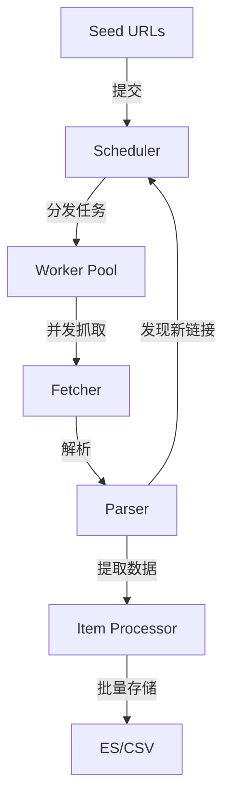
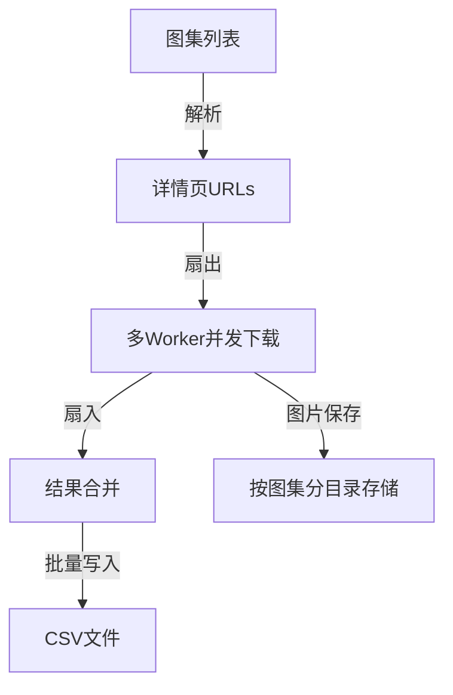

# go-spider

🚀 **基于Go语言的高性能并发爬虫框架**，采用现代并发模型和高效数据处理策略，支持多种数据源的并行爬取与存储。

## 项目亮点

- **高性能并发架构**：采用Worker模式实现任务并行处理，支持可配置的并发度
- **多源数据爬取**：同时支持珍爱网用户数据和3G壁纸图片资源的爬取
- **高效数据存储**：ES批量入库 + CSV文件存储，满足不同场景需求
- **智能图片下载**：采用扇入扇出模型，大幅提升图片下载效率
- **模块化设计**：清晰的分层架构，易于扩展和维护
- **容错机制**：内置重试机制和错误处理，保证爬取稳定性

## 目录结构

```
go-spider/
├── engine/           # 爬虫引擎核心
├── fetcher/          # 网页抓取模块
├── scheduler/        # 任务调度器
├── persist/          # 数据持久化
├── types/            # 通用类型定义
├── zhenai/           # 珍爱网爬虫解析器
├── 3gbizhi/          # 3G壁纸图片爬虫
├── single-task/      # 单任务版本爬虫
└── frontend/         # Web展示界面
```

## 核心架构

### 并发爬虫架构



### 技术栈

| 模块 | 技术/库 | 用途 |
|------|---------|------|
| 核心引擎 | Go协程 | 并发任务处理 |
| 网页抓取 | net/http + retry-go | 稳定的HTTP请求 |
| 数据解析 | goquery | HTML解析 |
| 数据存储 | Elasticsearch + CSV | 结构化数据存储 |
| 图片下载 | 扇入扇出模型 | 高效并发下载 |

## 功能模块

### 1. 珍爱网爬虫

**特点**：
- 采用JSON数据抓取策略，直接提取`window.__INITIAL_STATE__`
- ES批量入库，优化写入性能
- 支持城市列表和用户详情的层级爬取

**存储结构**：
- 索引：`dating_profile`
- 包含用户基本信息、择偶条件等结构化数据

### 2. 3G壁纸爬虫

**特点**：
- 动态页面爬取，支持列表页到详情页的深度抓取
- 图片下载采用扇入扇出模型，并发度可配置（默认20）
- 数据存储为CSV格式，便于后续分析

**下载策略**：


**存储结构**：
- CSV文件：`3gbizhi/data.csv`
- 图片目录：`images/[图集标题]/`

## 快速开始

### 环境要求

- Go >= 1.16
- Elasticsearch 8.0+ (可选，用于珍爱网数据存储)

### 安装与运行

```bash
# 克隆项目
git clone git@github.com:HeRedBo/go-spider.git
cd go-spider

# 安装依赖
go mod tidy

# 运行3G壁纸爬虫
go run main.go

# 如需查看 珍爱网爬虫 可以在 main.go 中 开启 珍爱网爬虫任务

# 启动Web展示界面
cd frontend
go run start.go
# 访问 http://localhost:8080

```

## 性能优化

1. **并发控制**：
   - Worker数量可根据系统资源动态调整
   - 图片下载并发度默认20，可通过配置文件修改

2. **数据存储**：
   - ES采用批量提交策略，减少网络开销
   - CSV写入使用缓冲机制，提高I/O效率

3. **网络优化**：
   - 随机User-Agent，减少被反爬识别
   - 内置重试机制，提高抓取成功率
   - 合理的超时设置，避免请求阻塞

## 扩展指南

### 添加新的爬虫

1. 在对应模块下创建解析器
2. 实现`ParseResult`接口
3. 配置数据存储方式
4. 在主程序中注册爬虫任务

### 自定义存储策略

1. 实现`persist.Entity`接口
2. 注册到存储工厂
3. 在启动配置中选择使用

## 项目架构流程图

### 单任务爬虫架构


### 并发爬虫架构


### Web页面展示效果


## 技术亮点分析

1. **Worker模式**：通过goroutine池实现任务并行处理，充分利用多核CPU资源
2. **扇入扇出模型**：在图片下载中应用，大幅提升并发效率
3. **批量处理**：无论是ES存储还是CSV写入，都采用批量操作减少I/O次数
4. **模块化设计**：各组件职责清晰，便于维护和扩展
5. **容错机制**：网络请求失败自动重试，提高爬取稳定性

## 适用场景

- **数据采集**：批量获取网站数据用于分析
- **内容监控**：定期抓取特定网站的更新
- **媒体资源下载**：高效下载图片、视频等媒体文件
- **搜索引擎索引**：为自定义搜索系统提供数据来源

## 许可证

MIT License

## 贡献

欢迎提交Issue和Pull Request！

---

**注**：本项目仅用于学习和研究目的，请勿用于任何违法或不当用途。